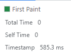
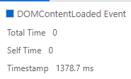

# **Анализ https://www.gd.ru/articles/9039-finansovyy-kontrol**

## **1. Network**

### **1.1 Профиль загрузки ресурсов**

[HAR](./profiles/www.gd.ru.har)

### **1.2 Неоптимальные места**

#### **1.2.1 Дублирование ресурсов**

Не уверен, являются ли нижние jquery дубликатами, или это какие-то плагины.

#### **1.2.2 Лишний размер ресурса**

Очень много элементов, состоящих из текста, загружаются и рендерятся в виде **растровых картинок(!)**.

Например:

1. Лого сайта, полностью состоящее из текста, это PNG

2. В шапке сайта есть целый список PNG ссылок с обычным текстом

В html остались комменты

В jquery остались комменты

Многие js файлы не минифицированны.

#### **1.2.3 Медленно загружающиеся ресурсы**

Если отсортировать ресурсы по времени загрузки, то можно заметить, что очень многие из них большинство времени провели в DNS lookup.

#### **1.2.4 Ресурсы, блокирующие загрузку**

async скрипты в head заблочат парсинг во время исполнения (но не во время загрузки), поэтому могут возникнуть задержки.

#### **1.2.5 Другое**

Много зафейленных запросов

Много редиректов

Картинка в начале статьи грузится лениво, хотя любой типичный посетитель до неё долистает. Из-за этого видно, как она рендерится во время чтения сайта.

----------

## **2. Perfomance**
### **2.1 Профиль**

[JSON](./profiles/Coverage-20230618T201917.json)

### **2.2 Время до FP, FCP, LCP, DCL, Load**

FP - 585.3 ms

FCP - 585.3 ms

DCL - 1378.7 ms

LCP - 1602 ms

Load - 41739 ms

### **2.3 Элемент, на котором происходит LCP**

Упомянутая выше лениво загружаемая картинка и есть LCP. Причем иногда она загрузится до DCL, иногда после, в зависимости от того, закрыт ли был по дефолту верхний баннер, и появилось ли модальное окно или нет.

### **2.4 Время на разные этапы обработки документа**

- Loading - 41 ms

- Scripting - 1531 ms

- Rendering - 566 ms

- Painting - 38 ms

----------

## **3. Coverage**
### **3.1 Профиль**

[JSON](./profiles/Coverage-20230618T201917.json)

### **3.2 Неиспользованный CSS**

~435 kB

### **3.3 Неиспользованный JS**

~2.27 MB

----------

Всего из 4.3 MB не было использовано 2.7 MB. Используются всего 36% из загруженных ресурсов.

----------
